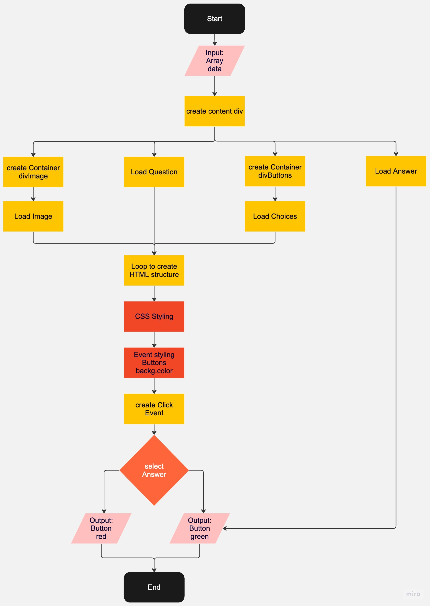

# Project Quiz

A little quiz consiting of images, questions and buttons for choices. The wrong answers become red and the correct asnwers become green when clicked on.
Informations were all substracted from an array containing objects.

Used methods:
- Arrow-functions
- EventListeners
- Arrays
- Objects
- createElement
- append

## Autors

This was a project that was done with a group. My thanks go to ...
- Arif
- Rainer
  
...for their help and teamwork. Even though each of us had to code for themselves, we were able to assist each other and learn from each other in the process.

## Try it out:

https://karakayametin8787.github.io/Project_Quiz/
## Screenshots

## Flowchart

